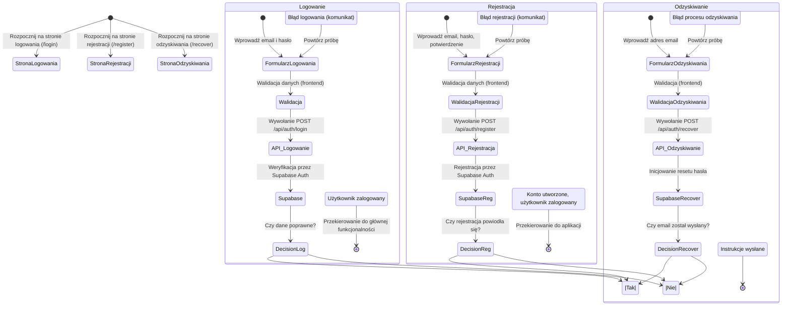

```mermaid 
stateDiagram-v2
    [*] --> StronaLogowania: Rozpocznij na stronie logowania (/login)
    
    state "Logowanie" as Logowanie {
        [*] --> FormularzLogowania: Wprowadź email i hasło
        FormularzLogowania --> Walidacja: Walidacja danych (frontend)
        Walidacja --> API_Logowanie: Wywołanie POST /api/auth/login
        API_Logowanie --> Supabase: Weryfikacja przez Supabase Auth
        Supabase --> DecisionLog: Czy dane poprawne?
        DecisionLog -->|Tak| Zalogowany: Użytkownik zalogowany
        DecisionLog -->|Nie| BladLogowania: Błąd logowania (komunikat)
        BladLogowania --> FormularzLogowania: Powtórz próbę
        Zalogowany --> [*]: Przekierowanie do głównej funkcjonalności
    }
    
    [*] --> StronaRejestracji: Rozpocznij na stronie rejestracji (/register)
    
    state "Rejestracja" as Rejestracja {
        [*] --> FormularzRejestracji: Wprowadź email, hasło, potwierdzenie
        FormularzRejestracji --> WalidacjaRejestracji: Walidacja danych (frontend)
        WalidacjaRejestracji --> API_Rejestracja: Wywołanie POST /api/auth/register
        API_Rejestracja --> SupabaseReg: Rejestracja przez Supabase Auth
        SupabaseReg --> DecisionReg: Czy rejestracja powiodła się?
        DecisionReg -->|Tak| KontoUtworzone: Konto utworzone, użytkownik zalogowany
        DecisionReg -->|Nie| BladRejestracji: Błąd rejestracji (komunikat)
        BladRejestracji --> FormularzRejestracji: Powtórz próbę
        KontoUtworzone --> [*]: Przekierowanie do aplikacji
    }
    
    [*] --> StronaOdzyskiwania: Rozpocznij na stronie odzyskiwania (/recover)
    
    state "Odzyskiwanie" as Odzyskiwanie {
        [*] --> FormularzOdzyskiwania: Wprowadź adres email
        FormularzOdzyskiwania --> WalidacjaOdzyskiwania: Walidacja (frontend)
        WalidacjaOdzyskiwania --> API_Odzyskiwanie: Wywołanie POST /api/auth/recover
        API_Odzyskiwanie --> SupabaseRecover: Inicjowanie resetu hasła
        SupabaseRecover --> DecisionRecover: Czy email został wysłany?
        DecisionRecover -->|Tak| Informacja: Instrukcje wysłane
        DecisionRecover -->|Nie| BladOdzyskiwania: Błąd procesu odzyskiwania
        BladOdzyskiwania --> FormularzOdzyskiwania: Powtórz próbę
        Informacja --> [*]
    }
```