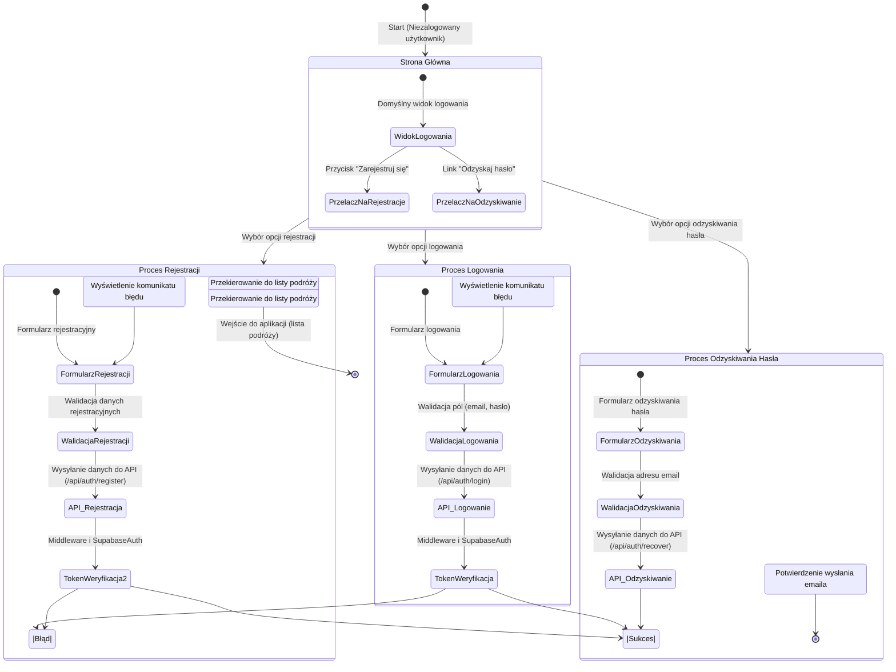

```mermaid 
stateDiagram-v2 [*] --> StronaGlowna: Start (Niezalogowany użytkownik)

state "Strona Główna" as StronaGlowna {
    [*] --> WidokLogowania: Domyślny widok logowania
    WidokLogowania --> PrzelaczNaRejestracje: Przycisk "Zarejestruj się"
    WidokLogowania --> PrzelaczNaOdzyskiwanie: Link "Odzyskaj hasło"
}

state "Proces Logowania" as Logowanie {
    [*] --> FormularzLogowania: Formularz logowania
    FormularzLogowania --> WalidacjaLogowania: Walidacja pól (email, hasło)
    WalidacjaLogowania --> API_Logowanie: Wysyłanie danych do API (/api/auth/login)
    API_Logowanie --> TokenWeryfikacja: Middleware i SupabaseAuth
    TokenWeryfikacja -->|Sukces| RedirectJourney: Przekierowanie do listy podróży
    TokenWeryfikacja -->|Błąd| BladLogowania: Wyświetlenie komunikatu błędu
    BladLogowania --> FormularzLogowania
}

state "Proces Rejestracji" as Rejestracja {
    [*] --> FormularzRejestracji: Formularz rejestracyjny
    FormularzRejestracji --> WalidacjaRejestracji: Walidacja danych rejestracyjnych
    WalidacjaRejestracji --> API_Rejestracja: Wysyłanie danych do API (/api/auth/register)
    API_Rejestracja --> TokenWeryfikacja2: Middleware i SupabaseAuth
    TokenWeryfikacja2 -->|Sukces| RedirectJourney: Przekierowanie do listy podróży
    TokenWeryfikacja2 -->|Błąd| BladRejestracji: Wyświetlenie komunikatu błędu
    BladRejestracji --> FormularzRejestracji
}

state "Proces Odzyskiwania Hasła" as Odzyskiwanie {
    [*] --> FormularzOdzyskiwania: Formularz odzyskiwania hasła
    FormularzOdzyskiwania --> WalidacjaOdzyskiwania: Walidacja adresu email
    WalidacjaOdzyskiwania --> API_Odzyskiwanie: Wysyłanie danych do API (/api/auth/recover)
    API_Odzyskiwanie -->|Sukces| InformacjaEmail: Potwierdzenie wysłania emaila
    InformacjaEmail --> [*]
}

StronaGlowna --> Logowanie: Wybór opcji logowania
StronaGlowna --> Rejestracja: Wybór opcji rejestracji
StronaGlowna --> Odzyskiwanie: Wybór opcji odzyskiwania hasła

RedirectJourney --> [*]: Wejście do aplikacji (lista podróży)
```