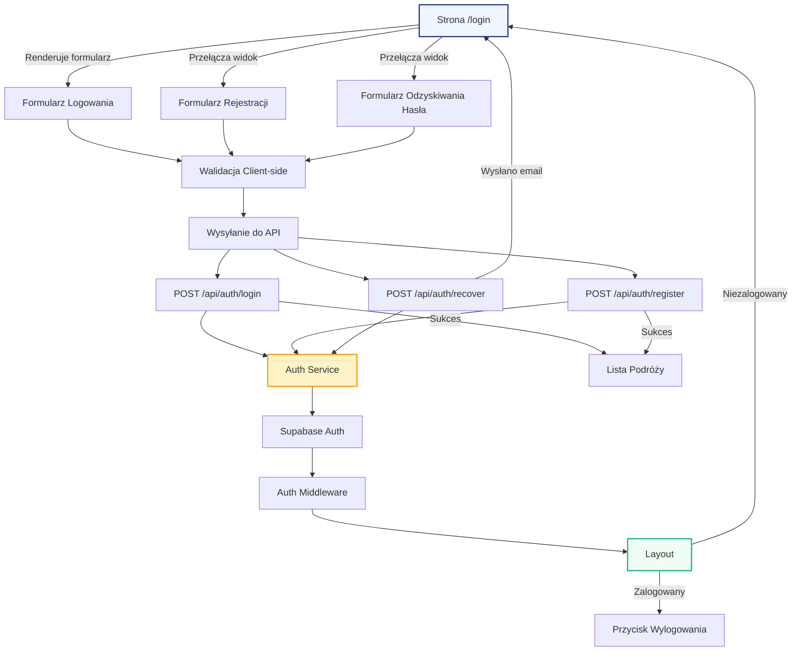

## Chart

```mermaid
flowchart TD
    %% Strony i Layout
    LoginPage[Strona /login] -->|Renderuje formularz| LoginForm[Formularz Logowania]
    LoginPage -->|Przełącza widok| RegisterForm[Formularz Rejestracji]
    LoginPage -->|Przełącza widok| RecoverForm[Formularz Odzyskiwania Hasła]
    
    MainLayout[Layout] -->|Niezalogowany| LoginPage
    MainLayout -->|Zalogowany| NavLogout[Przycisk Wylogowania]

    %% Komponenty React i walidacja
    LoginForm --> Validation[Walidacja Client-side]
    RegisterForm --> Validation
    RecoverForm --> Validation
    Validation --> ApiCalls[Wysyłanie do API]

    %% API Endpoints
    ApiCalls --> LoginAPI[POST /api/auth/login]
    ApiCalls --> RegisterAPI[POST /api/auth/register]
    ApiCalls --> RecoverAPI[POST /api/auth/recover]

    %% Backend i Supabase
    LoginAPI --> AuthService[Auth Service]
    RegisterAPI --> AuthService
    RecoverAPI --> AuthService
    AuthService --> SupabaseAuth[Supabase Auth]

    %% Middleware i zarządzanie sesją
    SupabaseAuth --> Middleware[Auth Middleware]
    Middleware --> MainLayout

    %% Przekierowania
    LoginAPI -->|Sukces| JourneyList[Lista Podróży]
    RegisterAPI -->|Sukces| JourneyList
    RecoverAPI -->|Wysłano email| LoginPage

    %% Style
    style LoginPage fill:#EFF6FF,stroke:#1E3A8A,stroke-width:2px
    style MainLayout fill:#F0FDF4,stroke:#10B981,stroke-width:2px
    style AuthService fill:#FEF3C7,stroke:#F59E0B,stroke-width:2px
```